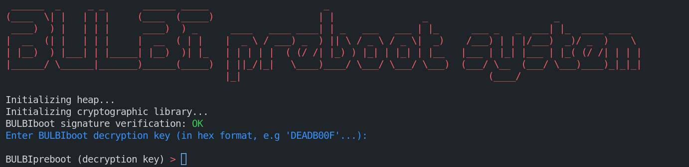
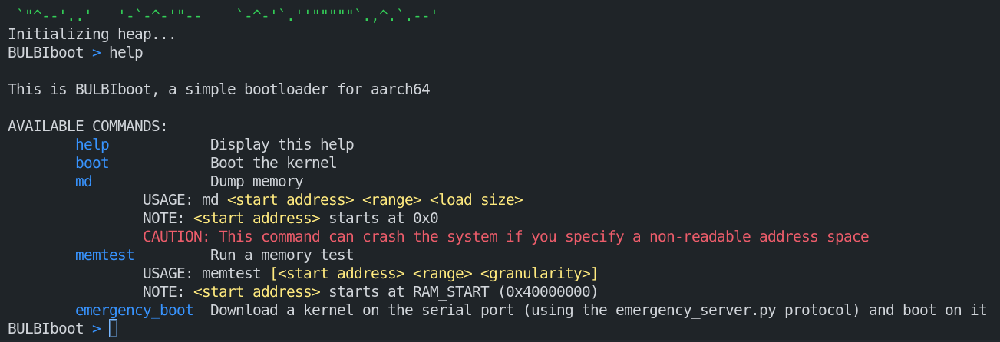
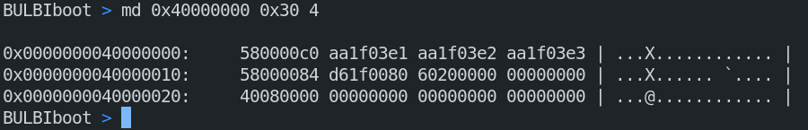
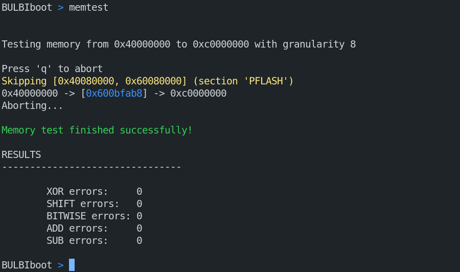
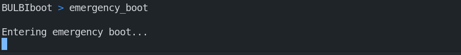

# How to use

## Preboot security system



When the bootloader starts, it will check the signature of the bootloader. If the signature is valid, the bootloader will continue to boot. Otherwise, the bootloader will stop and print an error message.

> For stupidity reasons, the Makefile targets dependencies are not fully efficient. Thus, the preboot can incorrectly validate the bootloader signature in case of rebuild. To fix this, you can run `make clean` before re-building the bootloader to make sure that the bootloader most recent signature is used in the source code.

After the signature check, the preboot system will ask you to enter a key. This key is used to decrypt the BULBIboot bootloader. If the key is valid, the preboot system will decrypt the bootloader and boot to it. Otherwise, the preboot system will print an error message and ask you to enter a new key.

> Note that the key must be written in hexadecimal format.

## BULBIboot bootloader


When the bootloader starts, it will print a _beautiful ASCII art_ and a prompt. You can use the following commands:

- `help` to show all the commands
- `boot` to boot the kernel
- `md` to dump some memory regions
- `memtest` to test the memory efficiency
- `emergency_boot` to download a kernel for emergency booting



## Commands
### `help` command

Pretty self-explanatory. This command will print all the available commands.

### `boot` command

To boot the kernel, you can use the `boot` command. The bootloader will check the CRC32 of the kernel and then boot it.

> NOTE that the boot protocol works in all Exception Levels (EL1, EL2 & EL3).

### `md` command

```bulbiboot
md <start_address> <length> <granularity>
```




To dump some memory regions, you can use the `md` command. This command will print the memory regions in hexadecimal format.

To use `md`, you need to specify the start address, the length and a granularity.

> The granularity is the size of one read. For example, if you want to read 4 bytes by 4 bytes, you need to specify a granularity of 4.
> Available granularities are **1, 2, 4 and 8**.

### `memtest` command

```bulbiboot
memtest [<start_address> <length> <granularity>]
```



To test the memory efficiency, you can use the `memtest` command. This command will write a pattern in the memory and then read it to check if the memory is working correctly.

To use `memtest`, you can specify the start address, the length and a granularity. If you don't specify any arguments, the bootloader will use the default values.

> By default, `md` will use the following values:
>
> - `start_address`: 0x00000000
> - `length`: RAM_SIZE
> - `granularity`: 8

### `emergency_boot` command

```bulbiboot
emergency_boot
```



To download a kernel for emergency booting, you can use the `emergency_boot` command. This command will download a kernel from the serial port and then boot it.

> WARNING: The emergency boot uses the same serial port as the console. Thus, you need to make sure to NOT read any data from the serial port while the kernel is downloading. To ensure that, make sure to use the `-serial pty` instead of `-serial stdio` option in QEMU.

To download the kernel, you need to do the following steps:

1. Type `emergency_boot` in the bootloader console
    > If you are using the `-serial pty`, you can do `echo "emergency_boot" > /dev/pts/<n>` to send the command to the bootloader. The `echo` command ensure that the command is sent and that no more data will be read from the serial port.
2. Launch the `emergency_server.py` script
    > You can do `python3 emergency_server.py <serial_port> <kernel_path>` to launch the script. The `serial_port` is the serial port used by the bootloader (the `/dev/pts/<n>`). The `kernel_path` is the path to the kernel to download.
3. The script will upload the kernel to the bootloader, and then the bootloader will boot it.

For more information about the emergency boot protocol, see [EMERGENCY_BOOT.md](EMERGENCY_BOOT.md).
